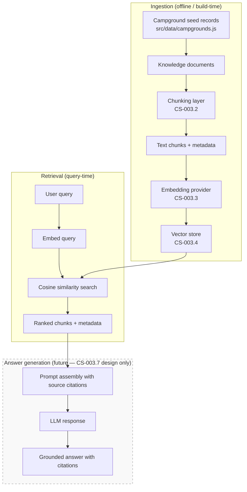
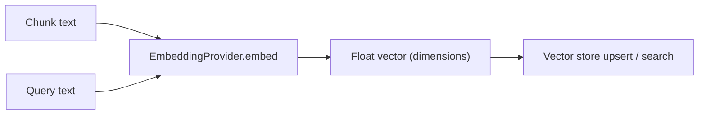

# RAG Architecture Plan — Epic CS-003

This document defines the planned Retrieval-Augmented Generation (RAG) architecture for Camp Scout AI. It covers the current keyword retrieval baseline, the semantic retrieval goal, and the planned pipeline from knowledge documents through chunking, embedding, vector storage, retrieval, and (eventually) answer generation.

**Scope:** Architecture and design only. No code, dependencies, or external API calls are introduced by this document. Implementation follows in subsequent CS-003 stories.

---

## Table of Contents

1. [Current State: Keyword Retrieval](#current-state-keyword-retrieval)
2. [Semantic Retrieval Goal](#semantic-retrieval-goal)
3. [End-to-End Pipeline Flow](#end-to-end-pipeline-flow)
4. [Chunking Approach](#chunking-approach)
5. [Embedding Approach](#embedding-approach)
6. [Vector Storage Options](#vector-storage-options)
7. [Answer-Generation Boundary](#answer-generation-boundary)
8. [Risks and Tradeoffs](#risks-and-tradeoffs)
9. [Implementation Roadmap](#implementation-roadmap)

---

## Current State: Keyword Retrieval

Camp Scout AI today stores campground knowledge as **20 hand-curated seed records** in `src/data/campgrounds.js`. Each record conforms to the `Campground` schema defined in `src/data/campgroundSchema.js`.

### Data model

| Field | Role in retrieval today |
|-------|-------------------------|
| `id` | Stable slug for detail-page lookup; **not searched** |
| `name` | Searchable |
| `region` | Searchable + exact-match facet filter |
| `sourceUrl` | Displayed in UI; **not searched** |
| `reservationUrl` | Displayed in UI; **not searched** |
| `amenities[]` | Searchable + membership facet filter |
| `rules[]` | **Not searched** |
| `dogPolicy` | **Not searched** |
| `notes` | Searchable |
| `lastVerifiedAt` | Metadata only; **not searched** |
| `tags[]` | Searchable + membership facet filter |

### Retrieval function

Keyword retrieval is implemented in `searchCampgrounds()` (`src/data/campgroundData.js`):

1. Load all records that pass `isValidCampground()`.
2. Apply optional exact-match filters on `region`, `amenity`, and `tag`.
3. If a text query is present, concatenate searchable fields into a lowercase haystack and test `haystack.includes(normalizedQuery)`.


### Characteristics and limitations

| Property | Current behavior |
|----------|------------------|
| Match type | Contiguous substring only |
| Ranking | None — original array order preserved |
| Tokenization | None — multi-word queries must appear as a contiguous substring |
| Synonyms | Not supported ("pet friendly" ≠ "dogs allowed") |
| Cross-field reasoning | Not supported ("campground near waterfalls" requires exact substring in haystack) |
| Fields excluded | `rules`, `dogPolicy`, `id`, URLs |
| Execution | Synchronous, client-side, in-memory |
| Scale | Fixed ~20 records |

### What works well

- **Fast and deterministic** — no network latency, no external services.
- **Facet filters** — region, amenity, and tag filters combine cleanly with text search.
- **Source attribution** — every record carries a real `sourceUrl` to an official park or agency page.
- **Data integrity** — invalid records are silently excluded via schema validation.

### What keyword retrieval cannot do

- Match by **meaning** when the user's words differ from the record text (e.g., "places I can bring my dog" vs. `dogPolicy: "Dogs allowed on leash"`).
- Search fields that are currently excluded (`rules`, `dogPolicy`).
- Rank results by relevance — all matches are equal.
- Answer natural-language questions — retrieval returns whole campground records, not targeted excerpts.

---

## Semantic Retrieval Goal

Semantic retrieval lets users search campground knowledge **by meaning**, not just exact keyword overlap. A query like "campgrounds where pets are welcome" should surface records whose `dogPolicy` says "Dogs allowed on leash" even though the word "pets" never appears in the haystack.

### Objectives

1. **Meaning-based matching** — embed queries and document chunks into a shared vector space; rank by cosine similarity.
2. **Field coverage** — include currently unsearchable fields (`rules`, `dogPolicy`) in the retrieval corpus.
3. **Source attribution** — every retrieved chunk carries `campgroundId`, `documentType`, and `sourceUrl` so answers can cite official sources.
4. **Composable with keyword search** — semantic retrieval supplements (not replaces) existing facet filters and substring search during the transition period.
5. **Testable without external APIs** — use a local fake embedding provider and in-memory vector store for unit tests (CS-003.3–CS-003.5).
6. **No AI-generated answers yet** — this epic builds the retrieval layer only; answer generation is designed but not implemented (CS-003.7).

### Non-goals (this epic)

- Live crawling or ingestion of park websites.
- Production embedding API integration (OpenAI, etc.).
- LLM answer synthesis.
- UI changes beyond what existing search already provides.
- Database or pgvector deployment.

### Success criteria

| Metric | Target |
|--------|--------|
| Recall on paraphrased queries | Semantic retrieval returns relevant chunks that keyword search misses |
| Source metadata on every result | `campgroundId`, `documentType`, `sourceUrl` present |
| Zero external API calls in tests | Fake provider + in-memory store only |
| Verification | `./scripts/verify.sh` passes after each story |

---

## End-to-End Pipeline Flow

The planned RAG pipeline transforms static campground records into searchable vector-indexed chunks, retrieves relevant chunks for a query, and (in a future epic) generates grounded answers.



### Stage summary

| Stage | Input | Output | Story |
|-------|-------|--------|-------|
| **Documents** | `Campground` records | Structured knowledge documents | Existing (CS-001) |
| **Chunking** | Knowledge documents | Searchable text chunks with metadata | CS-003.2 |
| **Embedding** | Text chunks / queries | Fixed-dimension float vectors | CS-003.3 |
| **Vector storage** | Vectors + metadata | Indexed store supporting similarity search | CS-003.4 |
| **Semantic retrieval** | Query string | Ranked chunks with source attribution | CS-003.5 |
| **Comparison** | Keyword vs. semantic results | Evaluation report with recommendations | CS-003.6 |
| **Answer generation** | Retrieved chunks + query | Cited natural-language answer | CS-003.7 (design) / future epic (implementation) |

### Planned module layout

```
src/
├── data/                          # Existing seed data + keyword search
│   ├── campgrounds.js
│   ├── campgroundSchema.js
│   └── campgroundData.js
└── rag/                           # New — semantic retrieval layer
    ├── chunking.js                # CS-003.2
    ├── chunking.test.js
    ├── embeddingProvider.js       # CS-003.3 — interface + fake provider
    ├── embeddingProvider.test.js
    ├── vectorStore.js             # CS-003.4 — in-memory cosine search
    ├── vectorStore.test.js
    ├── semanticRetrieval.js         # CS-003.5 — pipeline orchestration
    └── semanticRetrieval.test.js
```

Keyword search in `src/data/campgroundData.js` remains unchanged. Semantic retrieval is a parallel retrieval path consumed by tests and (later) the answer-generation layer.

---

## Chunking Approach

Chunking converts each campground record into one or more **searchable text chunks** while preserving source metadata for attribution.

### Document types

Each chunk is tagged with a `documentType` derived from the campground field it represents:

| documentType | Source field(s) | Example content |
|--------------|-----------------|-----------------|
| `overview` | `name`, `region`, `notes` | "Upper Pines Campground (Yosemite NP) — Yosemite Valley. Campground in Yosemite Valley with views of Half Dome." |
| `amenities` | `amenities[]` | "Amenities: Restrooms, Showers, Bear boxes, Shuttle access" |
| `rules` | `rules[]` | "Rules: Maximum 6 people per site, Food storage in bear boxes required" |
| `dog-policy` | `dogPolicy` | "Dog policy: Dogs allowed on leash in campground; not on trails." |
| `tags` | `tags[]` | "Tags: national-park, iconic, mountain, hiking" |

### Chunk structure

```js
{
  id: "yosemite-upper-pines::dog-policy",   // unique chunk identifier
  campgroundId: "yosemite-upper-pines",      // links back to seed record
  documentType: "dog-policy",                // field category
  sourceUrl: "https://www.nps.gov/yose/...", // official source from parent record
  text: "Dog policy: Dogs allowed on leash...", // embeddable text
  lastVerifiedAt: "2025-06-01"               // freshness metadata
}
```

### Chunking rules

1. **One chunk per document type per campground** — keeps chunks semantically focused and attribution clear.
2. **Skip empty fields** — if `rules` is an empty array, no `rules` chunk is produced.
3. **Prepend context** — each chunk's `text` begins with the campground name so embeddings retain campground identity even in isolated chunks.
4. **Deterministic IDs** — `{campgroundId}::{documentType}` ensures stable chunk IDs across rebuilds.
5. **No splitting within a field** — with ~20 records and short field values, sub-chunk splitting is unnecessary. Revisit if raw HTML ingestion is added later.

### Estimated corpus size

| Records | Chunks per record (avg) | Total chunks |
|---------|-------------------------|--------------|
| 20 | ~4–5 | ~80–100 |

This is small enough for an in-memory vector store with no performance concerns.

---

## Embedding Approach

Embeddings map text into a fixed-dimension vector space where semantically similar texts have high cosine similarity.

### Provider interface (CS-003.3)

```js
/**
 * @typedef {Object} EmbeddingProvider
 * @property {(text: string) => Promise<number[]>} embed
 * @property {number} dimensions
 */
```

All embedding generation goes through this interface so production and test providers are interchangeable.

### Test / fake provider

For unit tests and local development (CS-003.3):

- **No external API calls** — deterministic, in-process only.
- **No environment variables** — zero configuration.
- **Deterministic output** — same input text always produces the same vector (enables stable test assertions).
- **Semantic-ish behavior for tests** — the fake provider uses a simple token-overlap or hash-based scheme so that texts sharing words produce vectors with higher cosine similarity than unrelated texts. This is sufficient to demonstrate semantic-style retrieval in tests without calling a real model.

### Production provider (future — not in CS-003)

When production embeddings are added in a later epic:

| Option | Dimensions | Pros | Cons |
|--------|------------|------|------|
| OpenAI `text-embedding-3-small` | 1536 | High quality, well-documented | External API, cost, latency |
| OpenAI `text-embedding-3-large` | 3072 | Best quality | Higher cost and storage |
| Local model (e.g., `@xenova/transformers`) | varies | No API cost, offline | Larger bundle, lower quality, new dependency |

**Recommendation for production:** Start with `text-embedding-3-small` (1536 dims) when external APIs are approved. It offers strong quality-to-cost ratio for a corpus of ~100 chunks.

### Embedding workflow



### Re-embedding strategy

- **Build-time indexing** — embed all chunks when the vector index is built (not on every query).
- **Query-time embedding** — embed the user's query at search time.
- **Invalidation** — when seed data changes (`lastVerifiedAt` or field content), rebuild the index. With 20 records this is instantaneous.

---

## Vector Storage Options

The vector store holds chunk IDs, embedding vectors, and metadata, and supports similarity search.

### Phase 1: In-memory store (CS-003.4)

For learning, testing, and the initial semantic retrieval pipeline:

| Property | Value |
|----------|-------|
| Storage | JavaScript array in process memory |
| Search | Brute-force cosine similarity over all vectors |
| Persistence | None — rebuilt from chunks on startup or test setup |
| Dependencies | None |
| Scale limit | ~10,000 vectors (far above current ~100) |

**Interface:**

```js
/**
 * @typedef {Object} VectorStore
 * @property {(id, vector, metadata) => void} upsert
 * @property {(queryVector, topK) => ScoredChunk[]} search
 * @property {() => number} size
 */
```

Each search result returns the chunk metadata (`campgroundId`, `documentType`, `sourceUrl`, `text`) plus a similarity score.

### Phase 2 options (future — not in CS-003)

| Option | When to consider | Tradeoff |
|--------|------------------|----------|
| **JSON file on disk** | Persist index between restarts without a DB | Simple, but reload + re-embed on schema changes |
| **SQLite + vector extension** | Single-file persistence, no server | Adds dependency; overkill for 100 chunks |
| **pgvector (Supabase/Postgres)** | Multi-user, concurrent queries, large corpus | Infrastructure complexity; project already has Supabase wiring for legacy jobs |
| **Pinecone / Weaviate / Qdrant** | Managed scale, hybrid search | External service, cost, network dependency |

**Recommendation:** Stay with the in-memory store through CS-003. Revisit persistence when the corpus exceeds ~1,000 chunks or when a backend service is introduced. If Supabase is already deployed for other features, pgvector is the natural upgrade path.

### Cosine similarity

```
similarity(A, B) = dot(A, B) / (||A|| × ||B||)
```

Results are ranked descending by similarity score. A configurable `topK` (default 5) and optional `minScore` threshold prevent low-quality matches from reaching the answer layer.

---

## Answer-Generation Boundary

Answer generation is **designed but not implemented** in Epic CS-003. This section defines the boundary so retrieval and generation can be built independently.

### What retrieval provides to the answer layer

```js
{
  query: "Can I bring my dog to Yosemite?",
  results: [
    {
      chunkId: "yosemite-upper-pines::dog-policy",
      campgroundId: "yosemite-upper-pines",
      documentType: "dog-policy",
      sourceUrl: "https://www.nps.gov/yose/planyourvisit/upperpines.htm",
      text: "Dog policy: Dogs allowed on leash in campground; not on trails.",
      score: 0.87
    },
    // ... additional chunks up to maxChunks limit
  ]
}
```

### What the answer layer will do (future)

| Responsibility | Owner |
|----------------|-------|
| Chunk retrieval + ranking | Semantic retrieval pipeline (CS-003.5) |
| Prompt selection | Answer layer (future epic) |
| Prompt assembly with grounding instructions | Answer layer |
| LLM call | Answer layer |
| Citation formatting | Answer layer |
| Refusal when sources insufficient | Answer layer |

### Design constraints (detailed in CS-003.7)

- **Grounding rule:** Every factual claim must trace to a retrieved chunk's `sourceUrl`.
- **Citation format:** Inline references to official source URLs, not chunk IDs.
- **Refusal:** If no chunk exceeds the similarity threshold, respond with "I don't have enough information" rather than guessing.
- **Chunk limits:** Cap retrieved chunks sent to the LLM (e.g., max 5 chunks, max 2,000 tokens of context).
- **No hallucination:** The LLM prompt explicitly forbids adding facts not present in retrieved chunks.

Detailed prompt structure, citation requirements, and refusal behavior are documented in `docs/RAG_ANSWER_BOUNDARY.md` (CS-003.7).

### Hard boundary for CS-003

```
┌─────────────────────────────────────────────────┐
│  CS-003 scope (this epic)                       │
│  ┌─────────┐  ┌───────────┐  ┌──────────────┐  │
│  │ Chunking │→│ Embedding │→│ Vector store │  │
│  └─────────┘  └───────────┘  └──────────────┘  │
│       ↓                            ↓            │
│  ┌──────────────────────────────────────────┐   │
│  │     Semantic retrieval service          │   │
│  │     (returns ranked chunks + metadata)  │   │
│  └──────────────────────────────────────────┘   │
├─────────────────────────────────────────────────┤
│  Future epic (NOT in CS-003)                    │
│  ┌──────────────────────────────────────────┐   │
│  │  Answer generation (LLM + citations)     │   │
│  └──────────────────────────────────────────┘   │
└─────────────────────────────────────────────────┘
```

No OpenAI integration, no prompt execution, and no answer synthesis occur within CS-003.

---

## Risks and Tradeoffs

### Technical risks

| Risk | Impact | Mitigation |
|------|--------|------------|
| **Fake embeddings don't reflect real model behavior** | Tests pass but production retrieval quality differs | CS-003.6 comparison report evaluates both paths; add integration tests with real embeddings in a later epic |
| **Small corpus (~100 chunks)** | Semantic search advantage over keyword search may be marginal | Acceptable for learning; document findings in CS-003.6 |
| **No chunk splitting** | Long future documents may produce low-quality embeddings | Revisit chunking strategy when HTML ingestion is added |
| **In-memory store is ephemeral** | Index lost on restart | Acceptable for CS-003; persistence is a future concern |
| **Embedding model drift** | Re-embedding with a different model invalidates the index | Version the embedding model identifier; rebuild index on model change |

### Design tradeoffs

| Decision | Chosen | Alternative | Rationale |
|----------|--------|-------------|-----------|
| Chunk granularity | One chunk per field type | One chunk per campground | Field-level chunks improve retrieval precision and citation specificity |
| Vector store | In-memory | pgvector / Pinecone | Zero dependencies, sufficient for ~100 chunks, testable |
| Embedding provider | Interface + fake | Direct OpenAI integration | Keeps CS-003 free of external APIs and env vars |
| Keyword search | Keep unchanged | Replace with semantic | Parallel paths allow comparison (CS-003.6) and gradual migration |
| Answer generation | Design only | Implement now | Reduces scope; retrieval must work before answers are useful |

### Product risks

| Risk | Impact | Mitigation |
|------|--------|------------|
| **Stale seed data** | Retrieved chunks may not reflect current park rules | Display `lastVerifiedAt`; plan periodic re-verification workflow |
| **Over-reliance on semantic search** | Users expect AI answers, but CS-003 only retrieves chunks | Clear UI messaging; answer generation is a separate epic |
| **Source URL rot** | Official park pages move or disappear | Validate URLs periodically; store page content snapshots in a future ingestion story |

### Security and privacy

| Concern | Status |
|---------|--------|
| API keys in client bundle | Not applicable — no external APIs in CS-003 |
| User query logging | Not implemented; define policy before answer generation |
| PII in campground data | Seed data contains no PII |

---

## Implementation Roadmap

Stories within Epic CS-003, in dependency order:

| Story | Deliverable | Depends on |
|-------|-------------|------------|
| **CS-003.1** | This document (`docs/RAG_ARCHITECTURE.md`) | CS-001 seed data |
| **CS-003.2** | Chunking layer + tests | CS-003.1 |
| **CS-003.3** | Embedding provider interface + fake provider + tests | CS-003.1 |
| **CS-003.4** | In-memory vector store + cosine search + tests | CS-003.1 |
| **CS-003.5** | Semantic retrieval pipeline connecting all layers | CS-003.2, CS-003.3, CS-003.4 |
| **CS-003.6** | Retrieval comparison report (`docs/RETRIEVAL_COMPARISON.md`) | CS-003.5 |
| **CS-003.7** | Answer-generation boundary design (`docs/RAG_ANSWER_BOUNDARY.md`) | CS-003.5 |

Each story must pass `./scripts/verify.sh` before it is considered complete.

---

## References

| Resource | Location |
|----------|----------|
| Campground seed schema | `src/data/campgroundSchema.js` |
| Seed data (20 records) | `src/data/campgrounds.js` |
| Keyword search implementation | `src/data/campgroundData.js` → `searchCampgrounds()` |
| Template / routing inventory | `docs/TEMPLATE_INVENTORY.md` |
| Project verification script | `scripts/verify.sh` |
