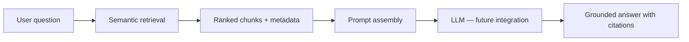

# RAG Prompt Design — Epic CS-004.4

This document defines the answer-generation prompt architecture for Camp Scout AI. It covers system instructions, source citation format, context injection, refusal behavior, and hallucination prevention rules.

**Scope:** Prompt design only. No OpenAI integration, no LLM calls, no answer generation code.

---

## Table of Contents

1. [Architecture Overview](#architecture-overview)
2. [System Prompt](#system-prompt)
3. [Source Citation Format](#source-citation-format)
4. [Context Injection Strategy](#context-injection-strategy)
5. [Refusal Behavior](#refusal-behavior)
6. [Hallucination Prevention Rules](#hallucination-prevention-rules)
7. [Example Prompt Assembly](#example-prompt-assembly)

---

## Architecture Overview

Camp Scout AI uses a **retrieval-first, generation-second** pattern:



The retrieval layer (CS-004.1–CS-004.3) is complete. This document defines what happens **after** retrieval, when an LLM is integrated in a future epic.

---

## System Prompt

```
You are Camp Scout AI, a helpful assistant for Northern California campground visitors.
You answer questions using ONLY the retrieved source excerpts provided below.

Rules:
1. Answer only from the provided context. Do not use outside knowledge.
2. Cite every factual claim with a source reference using the format [Source N].
3. If the context does not contain enough information to answer, say so clearly.
4. Never invent campground names, policies, fees, availability, or reservation details.
5. Direct users to official reservation portals for booking — you cannot check availability.
6. Use plain, friendly language appropriate for campers planning a trip.
7. When multiple campgrounds are relevant, organize your answer by campground.
8. Prefer quoting or closely paraphrasing the source text over summarizing from memory.
```

### Design rationale

| Rule | Purpose |
|------|---------|
| Context-only answers | Prevents hallucination from model training data |
| Mandatory citations | Enables user verification against official sources |
| Explicit refusal | Builds trust when information is missing |
| No availability claims | Aligns with CS-001 "availability not connected" policy |
| Plain language | Matches the app's camper-facing tone |

---

## Source Citation Format

Each retrieved chunk is numbered and injected with full metadata:

```
[Source 1]
Campground: Yosemite Upper Pines Campground
Document: Upper Pines Campground Rules (rules)
Excerpt: "Food must be stored in bear-resistant food lockers..."
Official source: National Park Service — https://www.nps.gov/yose/planyourvisit/upperpines.htm
Last verified: 2025-06-01
```

### In-line citation rules

- Use `[Source N]` immediately after each factual claim.
- Multiple sources for one claim: `[Source 1][Source 3]`.
- Do not invent source numbers — only cite sources present in the context block.
- Include the official URL in a "Sources" section at the end of every answer.

### End-of-answer sources block

```
Sources:
- [Source 1] National Park Service — https://www.nps.gov/yose/planyourvisit/upperpines.htm
- [Source 2] California State Parks — https://www.parks.ca.gov/...
```

---

## Context Injection Strategy

### Chunk selection

1. Retrieve top-K chunks via semantic search (default K=5, max K=8).
2. Deduplicate chunks from the same document (keep highest similarity).
3. Sort by similarity score descending.
4. Drop chunks below a similarity threshold (recommended: 0.3 for real embeddings; tune per model).

### Prompt structure

```
{system_prompt}

--- RETRIEVED CONTEXT ---

{formatted_source_1}

{formatted_source_2}

...

--- END CONTEXT ---

User question: {user_query}

Answer the question using only the retrieved context above. Cite sources for every claim.
```

### Token budget management

| Component | Budget (approx.) |
|-----------|------------------|
| System prompt | ~300 tokens |
| Retrieved context (5 chunks) | ~2,000 tokens |
| User question | ~100 tokens |
| Answer generation | ~500 tokens |
| **Total** | **~2,900 tokens** |

When context exceeds the budget, reduce K or truncate chunk text while preserving source metadata headers.

### Metadata preservation

Every injected chunk MUST include:

- `campgroundId` and campground name
- `documentType` and document title
- `sourceUrl` and `sourceName`
- `lastUpdatedAt`
- Chunk text excerpt

This ensures citations remain traceable even if the LLM paraphrases the content.

---

## Refusal Behavior

The assistant MUST refuse or defer when:

| Scenario | Response pattern |
|----------|-----------------|
| No relevant chunks retrieved | "I don't have information about that in my campground knowledge base. Try browsing the campground list or checking the official park website." |
| Partial information | Answer what is known, then: "I don't have complete information about [topic]. Please check [source URL] for the latest details." |
| Availability/booking questions | "I can't check live availability. Visit the official reservation portal: [reservationUrl from campground record]." |
| Out-of-scope questions (weather, directions, non-camping) | "That's outside what I can answer from campground knowledge. I can help with campground rules, reservations info, and park policies." |
| Conflicting sources | Present both versions with citations and recommend checking the official source for the most current information. |

### Refusal template

```
I couldn't find information about {topic} in the official campground sources I have access to.

What I can help with:
- Campground rules and policies
- Reservation information and booking windows
- Park alerts and notices

For the most current information, visit: {fallback_source_url}
```

---

## Hallucination Prevention Rules

### Grounding rules (enforced in system prompt)

1. **No unsourced claims** — every sentence with a factual assertion must have a `[Source N]` citation.
2. **No extrapolation** — do not infer policies, fees, or hours not stated in the context.
3. **No date invention** — use `lastUpdatedAt` from sources; do not guess when information was last checked.
4. **No campground invention** — only mention campgrounds present in retrieved chunks or the seed data catalog.
5. **Verbatim preference for rules** — when quoting rules (bear storage, fire restrictions, quiet hours), prefer direct quotes over paraphrase.
6. **Confidence signaling** — when similarity scores are low, prefix with: "Based on limited matching sources..."

### Post-generation validation (future)

When LLM integration is added, implement these checks before displaying an answer:

| Check | Action on failure |
|-------|-------------------|
| Every `[Source N]` references a valid injected source | Strip invalid citations |
| Answer mentions a campground not in context | Flag for review or regenerate |
| Answer contains availability language ("spots open", "book now") | Block and return refusal template |
| Answer length exceeds 2× context length | Truncate and warn |
| No citations in answer | Regenerate with stronger citation instruction |

### Temperature and model settings (recommended)

| Parameter | Value | Rationale |
|-----------|-------|-----------|
| Temperature | 0.1–0.3 | Low creativity reduces hallucination |
| Top-p | 0.9 | Moderate nucleus sampling |
| Max tokens | 500 | Limits runaway generation |
| Frequency penalty | 0 | Avoid distorting factual content |

---

## Example Prompt Assembly

### User query

> What are the bear food storage rules at Yosemite Upper Pines?

### Assembled prompt

```
You are Camp Scout AI, a helpful assistant for Northern California campground visitors.
You answer questions using ONLY the retrieved source excerpts provided below.

[... system rules ...]

--- RETRIEVED CONTEXT ---

[Source 1]
Campground: Yosemite Upper Pines Campground
Document: Upper Pines Campground Rules (rules)
Excerpt: "Food must be stored in bear-resistant food lockers or bear canisters when not being consumed."
Official source: National Park Service — https://www.nps.gov/yose/planyourvisit/upperpines.htm
Last verified: 2025-06-01

[Source 2]
Campground: Yosemite Upper Pines Campground
Document: Upper Pines Campground — Alerts (alert)
Excerpt: "Bear activity has increased in Yosemite Valley campgrounds. Store all scented items in food lockers."
Official source: National Park Service — https://www.nps.gov/yose/planyourvisit/upperpines.htm
Last verified: 2025-06-01

--- END CONTEXT ---

User question: What are the bear food storage rules at Yosemite Upper Pines?

Answer the question using only the retrieved context above. Cite sources for every claim.
```

### Expected answer shape

```
At Yosemite Upper Pines Campground, all food must be stored in bear-resistant food
lockers or bear canisters whenever it is not being consumed [Source 1]. Due to
increased bear activity in Yosemite Valley campgrounds, all scented items should
also be stored in food lockers [Source 2].

Sources:
- [Source 1] National Park Service — https://www.nps.gov/yose/planyourvisit/upperpines.htm
- [Source 2] National Park Service — https://www.nps.gov/yose/planyourvisit/upperpines.htm
```

---

## Next Steps

1. Implement prompt assembly function using retrieved chunks from `semanticRetrieval.js`.
2. Add post-generation validation checks before displaying answers.
3. Integrate with Azure OpenAI or similar LLM provider.
4. A/B test citation accuracy against the benchmark query suite from CS-004.3.
5. Add user feedback mechanism ("Was this answer helpful?") for continuous improvement.
